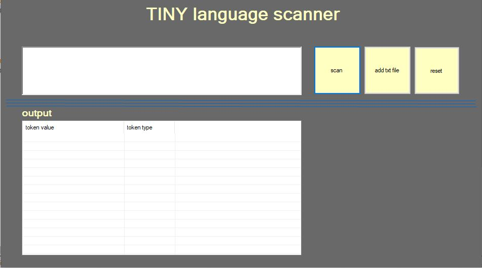

# Tiny-language-scanner
this application is used to do the first step in compiling code which is scanning the code to get tokens

# HOW TO USE?

	1.Add your code in the first textbox or you can add text file with your code

	using adding text file

	2.press scan button

	
	
	3.you will get a list of tokens in the table and the output is extracted into text file also
	

